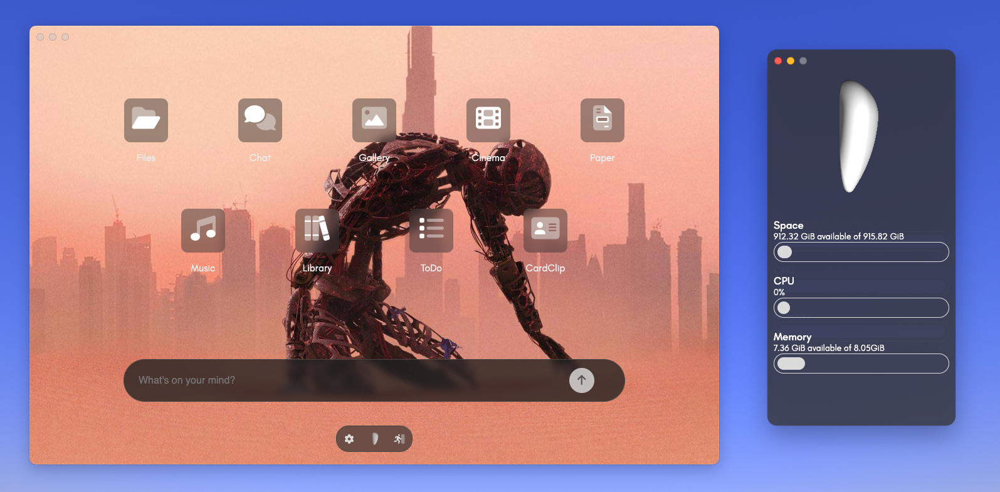

# persys-desktop

Persys desktop application. Electron based application to access your Persys server.

Refer to the [main](https://github.com/persys-ai/persys) repo for contributions and other instructions.

## Installation

Pull repo
`git clone https://github.com/persys-ai/persys-desktop`

Navigate to folder
`cd persys-desktop`

Install dependencies
`npm install`

Run it!
`npm start`

## Login
If you have already setup [persys-server](https://github.com/persys-ai/persys-server),
all you need to do is specify your address on the login page and use the password you created.
Do not use "http" or "https" in the server address on login.
If you're running the server on the same machine as the desktop app, simply put `localhost` in the address field.
The different ports for the services will use that base address.

## /assets
You'll find all assets here.

### /assets/interface
All JavaScript code.

### /assets/style
All CSS styling.

### /assets/lib
All libraries used in `/assets/interfaces/` here.

### /assets/images
Image assets.

## /src
All pages including `index.js` and `preload.js` here.

Each "app" has its own index html page for simplicity's sake.